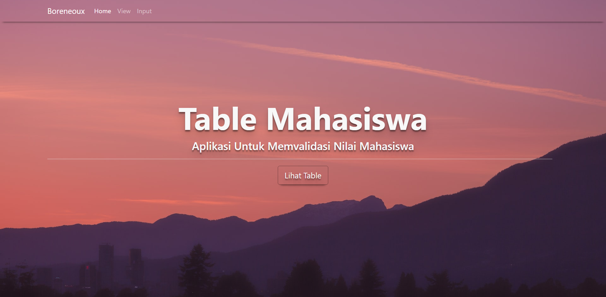
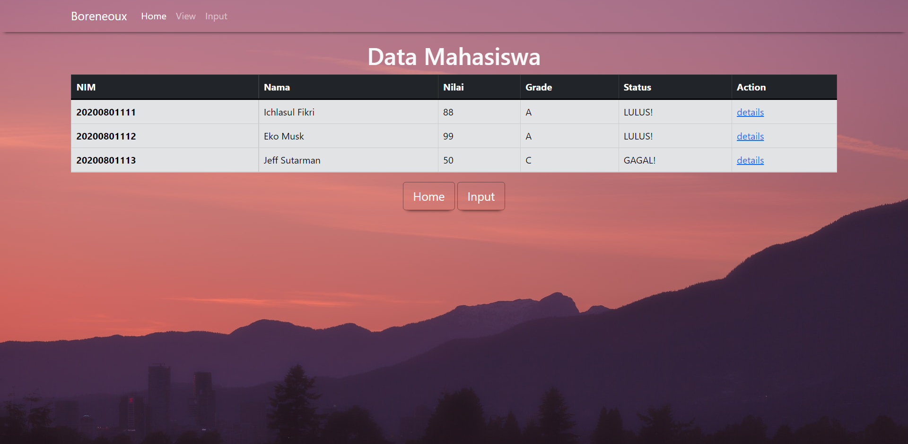
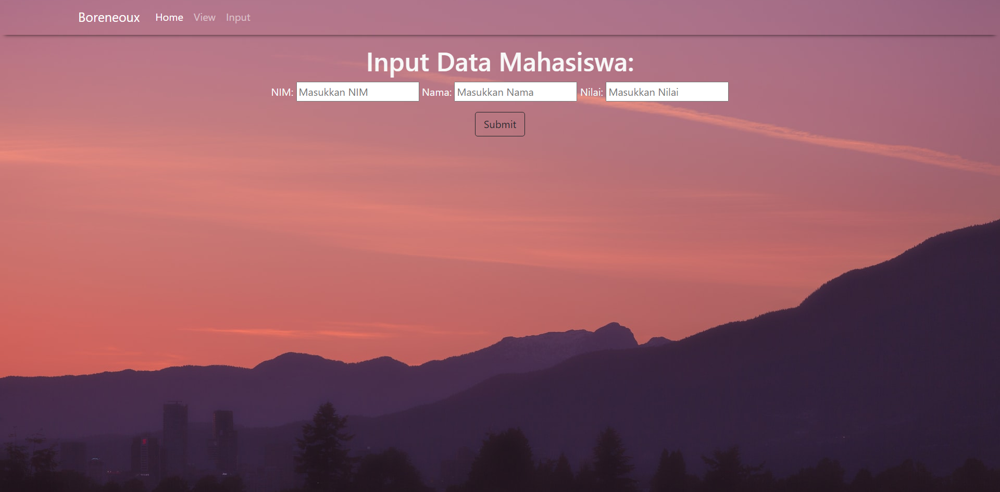
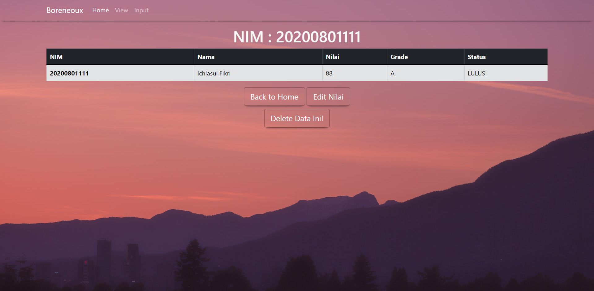
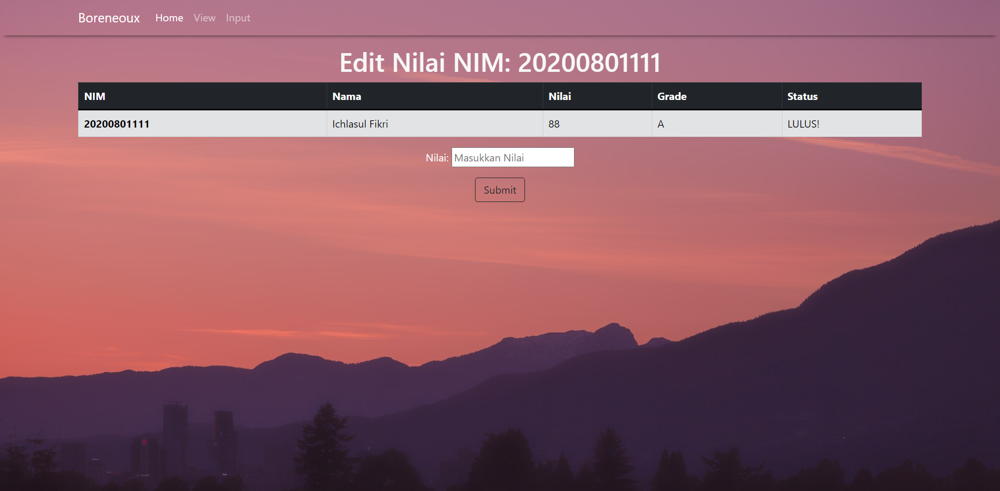

# Table Mahasiswa
WebApp ini dapat memvalidasi nilai mahasiswa untuk mengetahui apakah mahasiswa tersebut lulus atau gagal pada matakuliahnya. 
Kriteria Penilaian : 
80 – 100 = A (LULUS), 
60 – 79 = B (LULUS), 
0 – 59 = C (GAGAL).

## Yang digunakan pada project ini 
- [ExpressJS](https://expressjs.com/)
- [Bootstrap](https://getbootstrap.com/) 

## Tampilan Project
### Homepage :

### View Page:

### Input Page: 

### Show / Detail Page :

### Edit Page:

